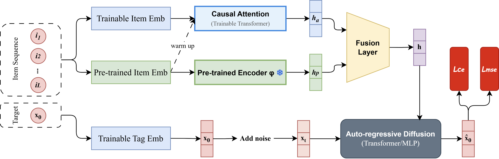

# GCFRec

Official implementation of **GCFRec: Gated Conditioning Fusion with Pretrained Sequential Encoders for Diffusion-Based Recommendation**.

GCFRec extends the token-level diffusion recommender ADRec with a frozen pretrained sequence encoder. A lightweight content-dependent gate fuses the task-adaptive and pretrained token representations before they enter the denoising decoder.



## Repository layout

```text
GCFRec/
├── datasets/data/          # Preprocessed dataset files used by the experiments
├── src/
│   ├── gcfrec.py            # GCFRec and the fusion operators
│   ├── adrec.py             # ADRec backbone
│   ├── *.py                 # Baseline implementations and shared utilities
│   ├── config.yaml          # Default experiment configuration
│   ├── main.py              # Training and evaluation entry point
│   └── saved/               # Pretrained sequence-encoder checkpoints
├── REPRODUCIBILITY.md    # Artifact and reproduction notes
└── requirements.txt      # Python dependencies
```

## Environment

The paper experiments used Ubuntu, Python 3.10.0, CUDA 12.4, PyTorch 2.4.0, and two NVIDIA L40 GPUs with 46 GB memory each. Create the Conda environment and install the pinned Python packages with:

```bash
conda create -n gcfrec python=3.10.0 -y
conda activate gcfrec
python -m pip install --upgrade pip
python -m pip install -r requirements.txt
```

The recorded Python and CUDA versions used for the artifact are listed in `REPRODUCIBILITY.md`.

## Data and pretrained encoders

The experiment code expects preprocessed data at `datasets/data/<dataset>/dataset.pkl`. The paper datasets are `baby`, `beauty`, `toys`, `sports`, and `ml-100k`. Each file contains the fixed train, validation, and test partitions used by all methods.

GCFRec loads its default frozen SASRec+ encoder from `src/saved/pretrain/<dataset>/pretrain.pth`. Alternative encoders used in the ablation are stored below `src/saved/{bert4rec,gru4rec,eulerformer}/<dataset>/pretrain.pth`.

## Run GCFRec

Commands are run from `src/` because the original pipeline uses paths relative to that directory:

```bash
cd src
python main.py \
  --model gcfrec \
  --dataset baby \
  --device cuda:0 \
  --random_seed 2025 \
  --gcf_fusion_type gate \
  --gcf_gate_mode scalar \
  --gate_init_bias 4
```

For a CPU smoke test, reduce the batch size and epochs. Full paper results require GPU training:

```bash
python main.py --model gcfrec --dataset baby --device cpu --epochs 1 --batch_size 8
```

## Baselines

Use the same entry point and replace `--model` with one of `sasrec`, `bert4rec`, `gru4rec`, `eulerformer`, `diffurec`, `dreamrec`, or `adrec`.

```bash
python main.py --model adrec --dataset baby --device cuda:0 --random_seed 2025
```

## Reproducibility scope

See [REPRODUCIBILITY.md](REPRODUCIBILITY.md) for dataset partitions, experiment configurations, pretrained checkpoints, and verification commands.

## Acknowledgements

This implementation builds on ADRec and includes adaptations of RecBole, DiffuRec, DreamRec, SASRec+, BERT4Rec, GRU4Rec, and EulerFormer. Retain the original licenses and cite the corresponding papers when using their implementations.

## License

See [LICENSE.txt](LICENSE.txt).
